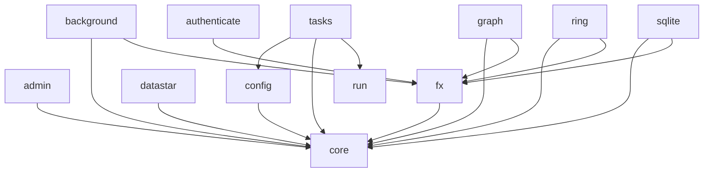

# Biff 2 (WIP)

See [Biff 2.0 sneak peak](biffweb.com/p/biff2/).

This repo contains the code for Biff 2.0: libraries and a demo app (though not
the starter app, which will be in a separate repo). I've completed a "rough
draft" of everything, so the overall structure is more-or-less locked in. Next
I'll take a manual pass over each library to simplify and test the code and to
write a README. I'll publish each library as I go. After that I'll move
everything from this temporary repo to [the main
repo](https://github.com/jacobobryant/biff) and then update [the
website](https://biffweb.com).

### Try it out

```bash
git clone https://github.com/jacobobryant/biff
cd biff
git checkout v2.x
cd demo
clj -M:run dev
```

It'll say it emailed you a sign-in link/code, but it'll actually just be printed
to the console. The demo app still has some bugs FYI. And also... please excuse
the exuberance with which my agent has denoted that the demo app is used by
myself for manual testing.

The libs all use `:local/root` dependencies so you can't actually add them as a
dependency on your own project (I think?) until I explicitly publish them.

## Libraries

Everything is subject to breaking changes for now, but if you'd like to try any
of the released libraries out in your own project, use a dependency like:

```
com.biffweb/<lib> {:mvn/version "2.0.0-rc19"}
```

Replacing `<lib>` with `core`, `config`, etc. After all the libs are published, the
`com.biffweb/biff` dependency will wrap all the individual libs (except for
`com.biffweb/tasks` and `biff.run` since those are dev-only).

Released:

- [biff.core](/libs/core/)
- [biff.config](/libs/config/)
- [biff.fx](/libs/fx/)
- [biff.graph](/libs/graph/)
- [biff.sqlite](/libs/sqlite/)
- [biff.xtdb](/libs/xtdb/)
- [biff.ring](/libs/ring/)
- [biff.datastar](/libs/datastar/)
- [biff.run](/libs/run/)
- [biff.tasks](/libs/tasks/)
- [biff.background](/libs/background/)

Remaining (see [libs/](/libs/)):

- biff.authenticate
- biff.admin
- [demo app](/demo)

And then I have a few more things to make that won't be/aren't yet in this repo:

- sqlite starter app (this will be like the demo app but more blank. e.g. see
  [biff-starter-sqlite](https://github.com/jacobobryant/biff-starter-sqlite)
  which is out of date now but is, you know, blank)
- XTDB starter app

I might also add some additional database adapter libraries. Ones I have in
mind:

- XTDB v1 (to make migrating from Biff v1 easier)
- Postgres
- Datomic
- Xitdb
- Datalevin
- Rama

### Dependency graph



### Resources

- [How to write a Biff database adapter](/docs/db-adapters.md)

TODO

## Tutorial

TODO. Might rewrite the old tutorial or might come up with something new.

## Guide

These will be "explanations" per the
[grand unified theory of documentation](https://docs.divio.com/documentation-system/)
definition. Relatively short and meant to (1) give you an overview of what
things Biff covers, (2) the conceptual approach Biff takes toward each of those
things, (3) links to other relevant documentation (howtos, reference, and
library READMEs).

TODO:

- Architecture
- Database
- HTTP handlers
- Frontend
- Background work
- Security
- Operations
- Code quality (tests/formatting/linting)

## Howto

TODO:

- Use the REPL
- Add DB schema
- Add a page
- Add an API route
- Add a work pipeline
- Customize the signin flow
- Provision a server and deploy
- Setup a sandboxed coding agent environment (with incus and/or docker
  sandboxes)
- Swap out the DB
- Migrate from Biff v1

## Essays

TODO

## Community

TODO

## LLMs

I use LLMs to generate a rough draft of pretty much all the code I write,
reading it thoroughly. I don't release code I haven't read or don't understand.
Before releasing, I edit the code (sometimes a little, sometimes a lot) and
write docs almost always manually. I don't edit the tests much, but I do
regenerate them after I write detailed docstrings which seems to work pretty
well.

Biff is intended to be a good framework for both manual and LLM-assisted
development.
