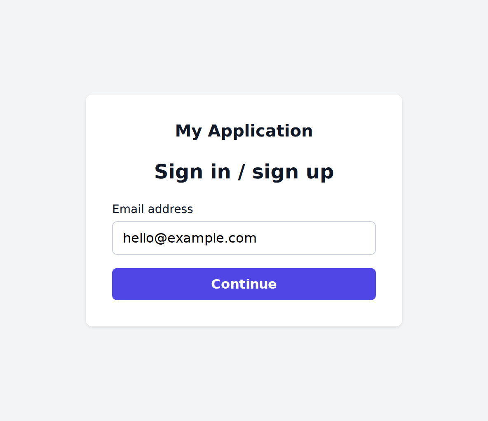
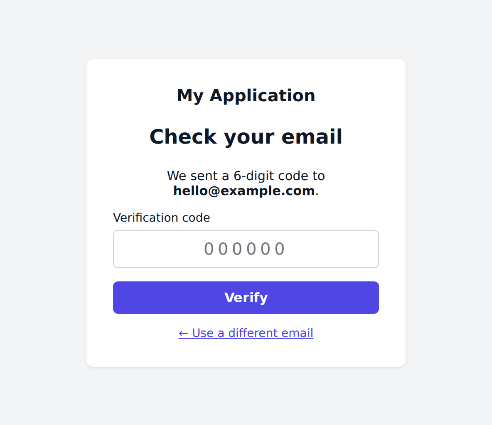

# biff.authenticate

A collection of Reitit routes which provide sign-in-via-email (6-digit code)
functionality to your web app, including a default signin page and pluggable
captcha/email providers.

<table>
  <tr>
    <td></td>
    <td></td>
  </tr>
</table>

### Dependency

```clojure
com.biffweb/authenticate {:mvn/version "2.0.0-rc20"}
```

### Status

This library will be a release candidate until all [the other Biff 2
libraries](/README.md) have been released. Until then there could be breaking
changes, but I don't anticipate any.

## Reference

- [Configuration](docs/config.md)
- [Routes](docs/routes.md)
- [API](docs/api/com.biffweb.authenticate.md)

## Usage

Call `routes` and include the result in your application's Reitit routes:

```clojure
(require '[com.biffweb.authenticate :as biff.auth])

(def auth-routes
  (biff.auth/routes {:biff.auth/app-name "My Application", ...}))

(def all-routes
  ["" {:middleware [...]}
   auth-routes
   ...])
```

If you're using [biff.core](/libs/core), you can use `module` instead:

```clojure
(def modules
  [(biff.auth/module {:biff.auth/app-name "My Application", ...})
   ...])
```

Configuration can be passed to `routes` / `module` as shown above, or it can be
included in the Ring request map. Use the following configuration in development
only to use the signin form without needing to set up captcha / email providers:

```clojure
:biff.auth/skip-captcha true
:biff.auth/send-email   (fn [_ctx email-params]
                          (prn email-params)
                          true)
```

You will also need to provide implementations of these functions (see the linked
docs):

- [:biff.core/kv-get](/libs/core/docs/reference/schema.md#biffcorekv-get)
- [:biff.core/kv-set](/libs/core/docs/reference/schema.md#biffcorekv-set)
- [:biff.auth/create-user](docs/config.md#biffauthcreate-user)
- [:biff.auth/get-user-id](docs/config.md#biffauthget-user-id)

If you're using [biff.sqlite](/libs/sqlite) or [biff.xtdb](/libs/xtdb), then
`kv-get` and `kv-set` should already be configured. Since `create-user` and
`get-user-id` are application-specific, you will always have to define your own
implementations for those.

### Signing out

Send a POST request to `/_biff/auth/signout`, including a CSRF token:

```clojure
(require '[com.biffweb.authentication :as biff.auth])

(defn my-signout-button [{:keys [anti-forgery-token] :as _request}]
  [:form {:method "post"
          ; You can use signout-path for convenience
          :action biff.auth/signout-path}
   [:input {:type "hidden"
            :name "__anti-forgery-token"
            :value anti-forgery-token}]
   [:button {:type "submit"} "Sign out"]])
```

### Captcha

Before using biff.authenticate in production, you will need to set configuration
for a captcha provider. biff.authenticate comes with configuration for three
providers; if you use one of those, you will only need to set a site key and
secret key:

- [`turnstile-config`](docs/api/com.biffweb.authenticate.md#turnstile-config):
  set
  [:biff.auth/turnstile-site-key](docs/config.md#biffauthturnstile-site-key)
  and
  [:biff.auth/turnstile-secret](docs/config.md#biffauthturnstile-secret)
- [`recaptcha-config`](docs/api/com.biffweb.authenticate.md#recaptcha-config):
  set
  [:biff.auth/recaptcha-site-key](docs/config.md#biffauthrecaptcha-site-key)
  and
  [:biff.auth/recaptcha-secret](docs/config.md#biffauthrecaptcha-secret)
- [`hcaptcha-config`](docs/api/com.biffweb.authenticate.md#hcaptcha-config):
  set
  [:biff.auth/hcaptcha-site-key](docs/config.md#biffauthhcaptcha-site-key)
  and
  [:biff.auth/hcaptcha-secret](docs/config.md#biffauthhcaptcha-secret)

For example:

```clojure
(biff.auth/routes (merge biff.auth/turnstile-config
                         {:biff.auth/app-name "My Application",
                          ...}))
```

[Cloudflare Turnstile](https://www.cloudflare.com/products/turnstile) provides
"invisible"/non-interactive captcha in its free tier which improves signup
conversion rates, whereas [hCaptcha](https://www.hcaptcha.com) is a more
privacy-preserving/not-Cloudflare option. I would only use reCAPTCHA if you
already have it set up.

If you would like to use a different provider, set
[:biff.auth/captcha-verify](docs/config.md#biffauthcaptcha-verify),
[:biff.auth/captcha-configured?](docs/config.md#biffauthcaptcha-configured),
and whatever other [captcha config keys](docs/config.md#captcha) are needed by
your provider. See
[com.biffweb.authenticate.impl.captcha](src/com/biffweb/authenticate/impl/captcha.clj)
for example implementations.

### Email

You will also need to provide a real
[`:biff.auth/send-email`](docs/config.md#biffauthsend-email) implementation. I
use [MailerSend](https://mailersend.com) which has a free tier. An example
implementation:

```clojure
(require '[hato.client :as hato])
(require '[clojure.tools.logging :as log])

(defn send-email
  [{:mailersend/keys [api-key from from-name reply-to] :as _ctx}
   {:keys [to subject html text code] :as _email-params}]
  (let [response
        (hato/post
         "https://api.mailersend.com/v1/email"
         {:headers          {;; use force to unwrap biff.config secrets
                             "Authorization" (str "Bearer " (force api-key))}
          :content-type     :json
          :throw-exceptions false
          :as               :json
          :form-params      {:from     {:email from
                                        :name  from-name}
                             :reply_to {:email reply-to
                                        :name  from-name}
                             :to       [{:email to}]
                             :subject  subject
                             :html     html
                             :text     text}})]
    (when (<= 400 (:status response))
      (log/warn "MailerSend error:" (:body response)))
    (< (:status response) 400)))
```

If you want to use a custom email template instead of the default one, you may
use `code` from the example above to generate your own values for `:html` and
`:text`.

If desired, you can have your `send-email` function print the email to the
console when in development and only send an actual email in production.

### Customizing the signup form

There are a few config options that can be used to change the appearance of the
default signin form:

- [:biff.auth/app-name](docs/config.md#biffauthapp-name)
- [:biff.auth/logo-url](docs/config.md#biffauthlogo-url)
- [:biff.auth/primary-color](docs/config.md#biffauthprimary-color)

If you'd like more control, you can disable the default signin form and provide
your own:

```clojure
(def auth-routes
  (biff.auth/routes
   {:biff.auth/include-signin-page false
    :biff.auth/signin-page         "/my-signin-page"
    ....}))

(def all-routes
  [auth-routes
   ["/my-signin-page" {:get my-signin-page}]])
```

You may copy
[`com.biffweb.authenticate.impl.frontend`](src/com/biffweb/authenticate/impl/frontend.clj)
into your project as a starting point.
